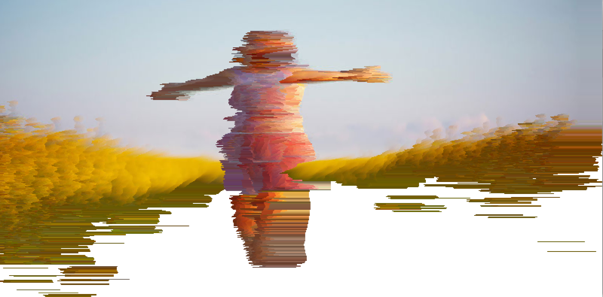

# atan0799_9103_tut01
## WEEK9_Quiz
### 20250508
#### Part 1: Imaging Technique Inspiration
- Pixel Sorting Effect in Digital Glitch Art
    - One imaging technique I find inspiring is the **pixel sorting glitch effect**, commonly seen in generative digital artworks. I am particularly drawn to how it deconstructs an image by "melting" its structure into abstract flows, revealing new visual rhythms. For our assignment, I would like to incorporate a simplified version of this into segment-based image reconstruction—perhaps as a state triggered by user interaction or time. This effect can visually express a transformation or decay, making the static representation dynamic and conceptually intriguing.

#### Part 2: Coding Technique Exploration
- 1D Pixel Sorting Algorithm in p5.js
    - To implement this kind of distortion, I found a **pixel sorting algorithm** written in p5.js that scans an image row-by-row, identifies pixel brightness thresholds, and then reorders them accordingly. This could be applied to our segmented image: triggering certain segments to shift pixel order when clicked or hovered. It enables expressive reimagining of the image without needing full animation.

[example implementation](https://editor.p5js.org/jordanBlueshift/sketches/HJVD0ESb7)
